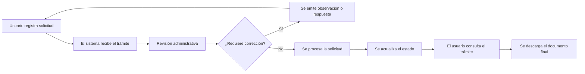
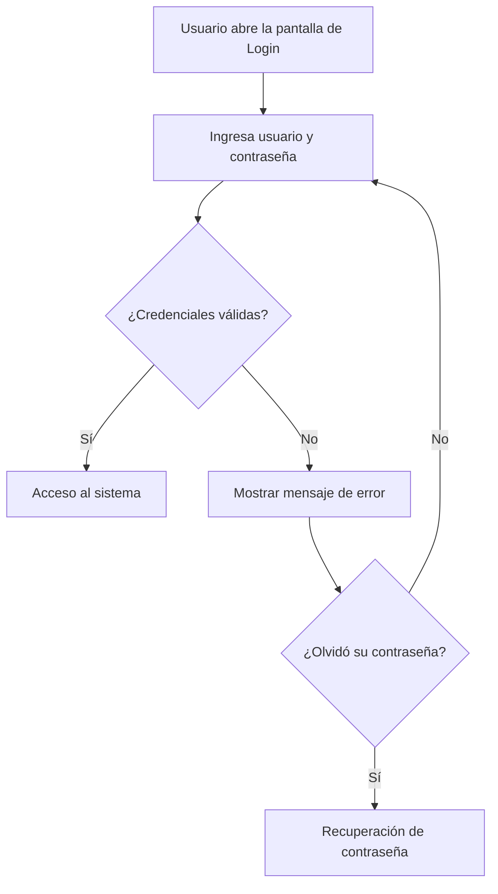
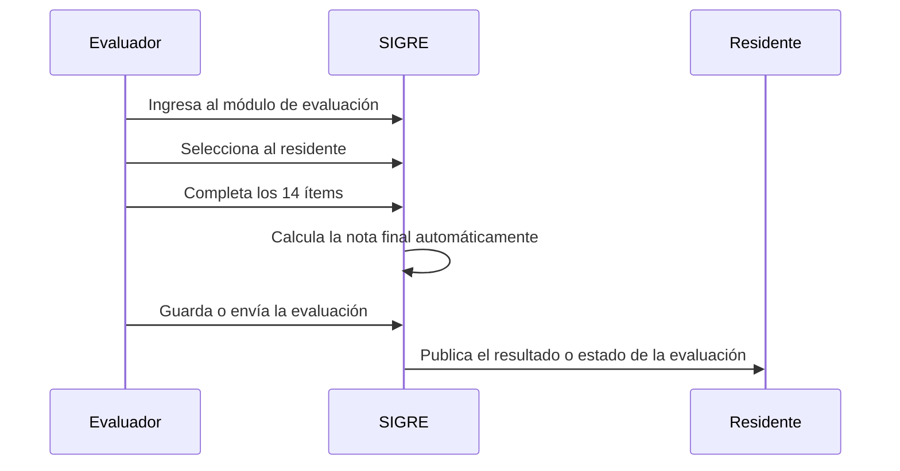
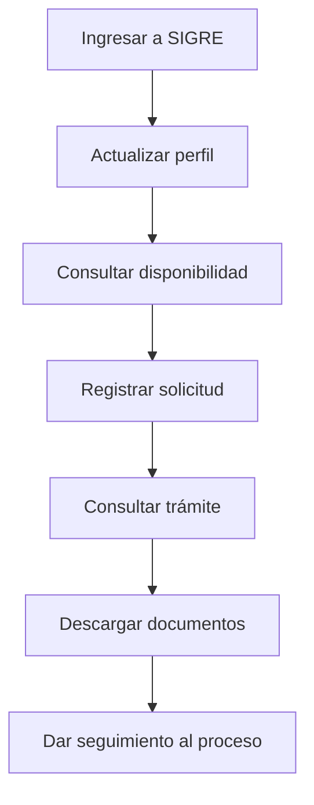
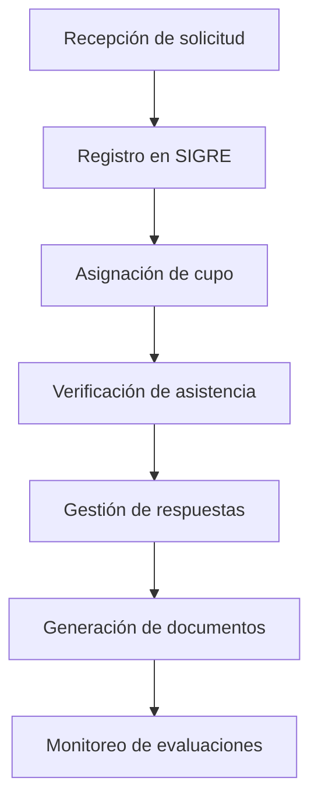
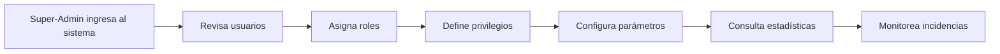
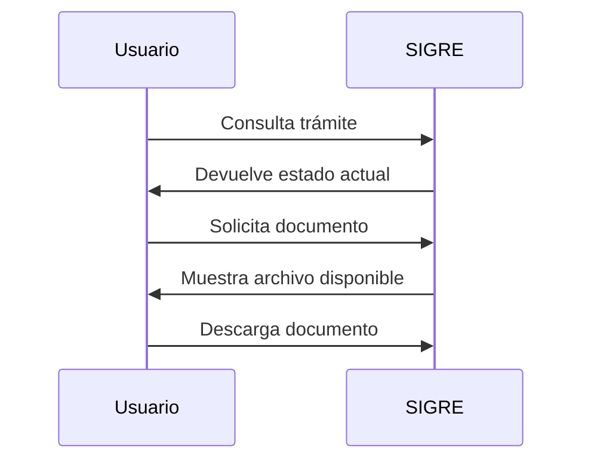
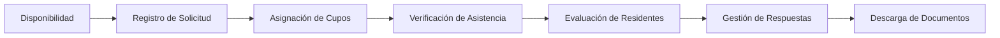
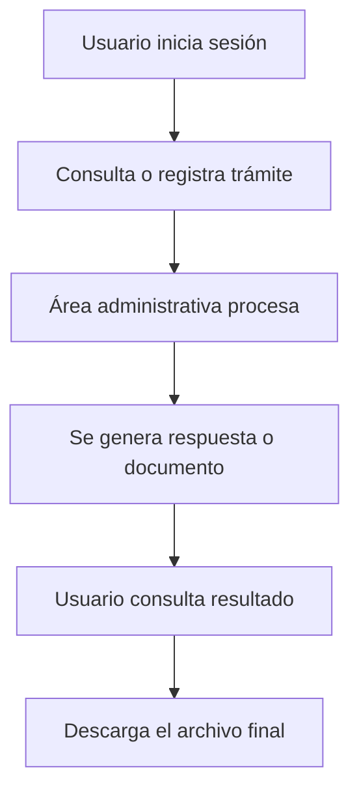

# Manual de Ayuda y Tutoriales SIGRE
## Sistema de Gestión del Residentado del INCOR

**Versión:** 1.0  
**Fecha:** Julio 2026  
**Dirigido a:** Residentes, Evaluadores, Personal Administrativo OAIYDE, Personal Universitario y Super-Administración

---

## Tabla de Contenido

1. Presentación
2. Cómo usar este manual
3. Diagramas del sistema
4. Guías por tipo de usuario
5. Tutoriales por módulo
6. Preguntas frecuentes
7. Glosario

---

# 1. Presentación

SIGRE es la plataforma institucional del INCOR para administrar el residentado de manera centralizada. Permite gestionar solicitudes, evaluar residentes, consultar disponibilidad, emitir documentos, controlar asistencia, administrar usuarios y supervisar el avance de procesos académicos y administrativos.

Este manual reúne instrucciones básicas y avanzadas para orientar a cada tipo de usuario en las tareas más frecuentes dentro del sistema. Su finalidad es reducir errores, facilitar la navegación y apoyar el uso correcto de cada módulo.

---

# 2. Cómo usar este manual

- Cada guía está organizada por tipo de usuario.
- Cada tutorial corresponde a un módulo específico del sistema.
- Las capturas sugeridas sirven como referencia para documentar el sistema con imágenes reales.
- Los ejemplos están redactados en lenguaje claro y pueden adaptarse a la versión institucional final.

---

# 3. Diagramas del sistema

## 3.1 Vista general de usuarios y módulos

```mermaid
flowchart TD
    A[Ingreso a SIGRE] --> B{Tipo de usuario}

    B --> C[Residente]
    B --> D[Evaluador]
    B --> E[Administrativo OAIYDE]
    B --> F[Personal Universitario]
    B --> G[Super-Admin]

    C --> C1[Disponibilidad]
    C --> C2[Registro de Solicitud]
    C --> C3[Consulta de Trámite]
    C --> C4[Registro / Actualización de Perfil]
    C --> C5[Descarga de Documentos]

    D --> D1[Evaluación de Residentes]
    D --> D2[Instrumento de 14 ítems]
    D --> D3[Cálculo automático de nota final]

    E --> E1[Registro de Solicitud]
    E --> E2[Asignación de Cupos]
    E --> E3[Verificación de Asistencia]
    E --> E4[Gestión de Respuestas]
    E --> E5[Generación de Hojas de Evaluación]
    E --> E6[Plan de Trabajo]
    E --> E7[Monitoreo de Evaluaciones]

    F --> F1[Disponibilidad]
    F --> F2[Consulta de Trámite]
    F --> F3[Descarga de Hojas de Evaluación]
    F --> F4[Descarga de Cartas de Respuesta]

    G --> G1[Gestión de Usuarios]
    G --> G2[Privilegios de Acceso]
    G --> G3[Configuración del Sistema]
    G --> G4[Estadísticas del Programa]
    G --> G5[Monitoreo del Sistema]
    G --> G6[Asignación de Roles]
```

## 3.2 Flujo general de una solicitud

## 3.3 Flujo de autenticación

## 3.4 Flujo de evaluación de residentes

## 3.5 Ciclo operativo del Residente

## 3.6 Flujo del Administrativo OAIYDE

## 3.7 Flujo de administración del sistema

## 3.8 Consulta y descarga de documentos

## 3.9 Relación entre módulos clave

## 3.10 Flujo simplificado del proceso institucional

---

# 4. Guías por tipo de usuario

## 4.1 Guía del Residente

### Introducción
El Residente utiliza SIGRE para consultar su información, revisar la disponibilidad de cupos, registrar solicitudes, hacer seguimiento a trámites y descargar documentos relacionados con su proceso formativo.

También puede actualizar su perfil para mantener sus datos personales y académicos al día. Esto es importante porque muchos procesos del sistema dependen de la información registrada en su cuenta.

### Índice
1. Login
2. Registro y actualización de perfil
3. Disponibilidad
4. Registro de solicitud
5. Consulta de trámite
6. Descarga de documentos

### Login
**Objetivo:** Acceder al sistema con credenciales válidas.

**Paso a paso:**
1. Abra la pantalla de ingreso de SIGRE.
2. Ingrese su usuario o correo institucional.
3. Escriba su contraseña.
4. Presione Ingresar.
5. Espere la validación del sistema.
6. Verifique que se cargue su panel de usuario.

**Captura sugerida:** Pantalla de inicio de sesión con campos de usuario y contraseña.

### Registro y actualización de perfil
**Objetivo:** Mantener actualizados los datos personales, académicos y de contacto.

**Paso a paso:**
1. Ingrese al módulo de perfil.
2. Revise nombres, apellidos, DNI y correo.
3. Actualice teléfono y demás datos personales.
4. Complete o revise la información académica.
5. Verifique la profesión y campos relacionados.
6. Guarde los cambios.

**Captura sugerida:** Formulario de perfil con datos personales y campos del residente.

### Disponibilidad
**Objetivo:** Consultar cupos y opciones disponibles antes de registrar una solicitud.

**Paso a paso:**
1. Abra el módulo Disponibilidad.
2. Aplique filtros de búsqueda.
3. Revise los cupos y servicios mostrados.
4. Compare opciones por sede, servicio o periodo.
5. Lea observaciones o restricciones.
6. Seleccione la opción más conveniente.

**Captura sugerida:** Tabla de disponibilidad con filtros activos.

### Registro de solicitud
**Objetivo:** Presentar una solicitud formal dentro del sistema.

**Paso a paso:**
1. Acceda al módulo Registro de Solicitud.
2. Seleccione el tipo de solicitud.
3. Complete los datos requeridos.
4. Ingrese la información adicional solicitada.
5. Revise campos obligatorios.
6. Confirme el envío.
7. Guarde el número de seguimiento.

**Captura sugerida:** Formulario de solicitud con botón de envío.

### Consulta de trámite
**Objetivo:** Revisar el estado de una solicitud registrada.

**Paso a paso:**
1. Ingrese al módulo Consulta de Trámite.
2. Busque por número, DNI o ID de SIGRE.
3. Revise el estado actual del trámite.
4. Lea observaciones o respuestas.
5. Verifique si existen documentos asociados.
6. Consulte nuevamente si el trámite sigue en proceso.

**Captura sugerida:** Vista de consulta con estado, observaciones y detalle del trámite.

### Descarga de documentos
**Objetivo:** Descargar archivos emitidos por el sistema.

**Paso a paso:**
1. Abra el módulo de descarga de documentos.
2. Ubique el documento requerido.
3. Verifique el nombre y fecha del archivo.
4. Haga clic en Descargar.
5. Guarde el archivo en su dispositivo.
6. Abra el documento para confirmar que fue descargado correctamente.

**Captura sugerida:** Lista de documentos con botones de descarga.

## 4.2 Guía del Evaluador

### Introducción
El Evaluador registra la valoración del residente mediante instrumentos definidos por el programa. SIGRE facilita este proceso al permitir la selección del residente, el llenado del instrumento y el cálculo automático de la nota final.

Este perfil tiene una función académica crítica, ya que sus evaluaciones forman parte del seguimiento formal del desempeño del residente. Por ello, el sistema busca garantizar uniformidad, trazabilidad y validación completa de cada registro.

### Índice
1. Acceso al módulo de evaluación
2. Selección del residente
3. Instrumento de 14 ítems
4. Escala de calificación
5. Cálculo automático de nota final
6. Cierre de la evaluación

### Acceso al módulo de evaluación
**Objetivo:** Entrar al espacio destinado a la evaluación de residentes.

**Paso a paso:**
1. Inicie sesión con su cuenta de Evaluador.
2. Abra el módulo Evaluación de Residentes.
3. Seleccione el periodo o servicio correspondiente.
4. Ubique al residente a evaluar.
5. Inicie el formulario.

**Captura sugerida:** Panel de evaluación con residentes disponibles.

### Selección del residente
**Objetivo:** Elegir correctamente al residente que será evaluado.

**Paso a paso:**
1. Busque por nombre, ID o servicio.
2. Revise la ficha del residente.
3. Verifique que corresponda al periodo correcto.
4. Confirme la selección.
5. Espere la carga del instrumento.

**Captura sugerida:** Selector de residente con datos básicos.

### Instrumento de 14 ítems
**Objetivo:** Completar la evaluación con los criterios oficiales.

**Paso a paso:**
1. Lea cada ítem antes de responder.
2. Evalúe el desempeño observado.
3. Asigne una calificación a cada uno de los 14 ítems.
4. Evite dejar campos en blanco.
5. Revise observaciones si corresponde.
6. Verifique que todas las respuestas estén completas.

**Captura sugerida:** Formulario con los 14 ítems visibles.

### Escala de calificación
**Objetivo:** Aplicar correctamente la escala definida por el sistema.

**Paso a paso:**
1. Identifique la escala disponible.
2. Seleccione la opción que corresponda a la observación.
3. Mantenga criterios homogéneos en toda la evaluación.
4. Revise que no haya ítems inconsistentes.
5. Corrija cualquier respuesta antes de guardar.

**Captura sugerida:** Ítems con escala de selección visible.

### Cálculo automático de nota final
**Objetivo:** Permitir que el sistema calcule la nota total automáticamente.

**Paso a paso:**
1. Complete todos los ítems del instrumento.
2. Observe la nota final calculada por SIGRE.
3. Verifique que el cálculo cambie al modificar una respuesta.
4. Compare el resultado con su criterio de evaluación.
5. Revise nuevamente si el valor no coincide con lo esperado.

**Captura sugerida:** Sección final con nota o promedio calculado.

### Cierre de la evaluación
**Objetivo:** Guardar y finalizar la evaluación registrada.

**Paso a paso:**
1. Revise todos los campos completados.
2. Verifique periodo, residente y observaciones.
3. Presione Guardar o Enviar.
4. Confirme el mensaje de éxito.
5. Descargue o imprima evidencia si corresponde.
6. Cierre la sesión si terminó su trabajo.

**Captura sugerida:** Botón final de envío y mensaje de confirmación.

## 4.3 Guía del Administrativo OAIYDE

### Introducción
El Personal Administrativo de OAIYDE participa activamente en el flujo operativo del SIGRE. Desde su perfil puede registrar solicitudes, asignar cupos, verificar asistencia, gestionar respuestas, generar documentos y dar seguimiento a evaluaciones.

Su función es clave para mantener el orden del proceso institucional. Por ello, el sistema centraliza la información y ayuda a reducir tareas repetitivas y errores de registro.

### Índice
1. Registro de solicitud
2. Asignación de cupos
3. Verificación de asistencia
4. Gestión de respuestas
5. Generación de hojas de evaluación
6. Plan de trabajo
7. Monitoreo de evaluaciones

### Registro de solicitud
**Objetivo:** Ingresar y canalizar solicitudes recibidas por la institución.

**Paso a paso:**
1. Abra el módulo Registro de Solicitud.
2. Revise los datos del solicitante.
3. Seleccione el tipo de solicitud.
4. Complete los campos requeridos.
5. Agregue observaciones si corresponde.
6. Guarde la solicitud.

**Captura sugerida:** Formulario administrativo de solicitud.

### Asignación de cupos
**Objetivo:** Distribuir cupos según la disponibilidad y los criterios institucionales.

**Paso a paso:**
1. Ingrese al módulo Asignación de Cupos.
2. Revise la disponibilidad actual.
3. Seleccione la solicitud o grupo de solicitudes.
4. Elija sede, servicio o periodo.
5. Confirme la asignación.
6. Verifique que el cambio quedó registrado.

**Captura sugerida:** Tabla de cupos con acción de asignación.

### Verificación de asistencia
**Objetivo:** Controlar la asistencia y detectar incidencias.

**Paso a paso:**
1. Abra el módulo Verificación de Asistencia.
2. Filtre por periodo o servicio.
3. Revise los registros mostrados.
4. Marque observaciones si existen inconsistencias.
5. Guarde los cambios.
6. Verifique el resumen final.

**Captura sugerida:** Tabla de asistencia con observaciones.

### Gestión de respuestas
**Objetivo:** Emitir respuestas formales a solicitudes o trámites.

**Paso a paso:**
1. Acceda al módulo de respuestas.
2. Localice la solicitud pendiente.
3. Revise el historial del caso.
4. Redacte o seleccione la respuesta.
5. Genere el documento.
6. Confirme el registro.

**Captura sugerida:** Trámite seleccionado con área de respuesta.

### Generación de hojas de evaluación
**Objetivo:** Crear hojas de evaluación para el proceso académico.

**Paso a paso:**
1. Ingrese al módulo correspondiente.
2. Seleccione el residente o periodo.
3. Revise los datos cargados.
4. Genere la hoja de evaluación.
5. Descargue o distribuya el archivo.
6. Confirme que el documento fue creado.

**Captura sugerida:** Pantalla de generación de documento.

### Plan de trabajo
**Objetivo:** Registrar y dar seguimiento a las actividades institucionales.

**Paso a paso:**
1. Abra el módulo Plan de Trabajo.
2. Revise el periodo activo.
3. Ingrese actividades, fechas y responsables.
4. Actualice el estado de avance.
5. Guarde los cambios.
6. Consulte el progreso cuando sea necesario.

**Captura sugerida:** Lista de actividades con estado.

### Monitoreo de evaluaciones
**Objetivo:** Supervisar evaluaciones en curso y detectar pendientes.

**Paso a paso:**
1. Ingrese al módulo de monitoreo.
2. Seleccione el periodo deseado.
3. Filtre por servicio o especialidad.
4. Revise estados de avance.
5. Detecte casos pendientes.
6. Haga seguimiento si corresponde.

**Captura sugerida:** Panel de monitoreo con indicadores de avance.

## 4.4 Guía del Personal Universitario

### Introducción
El Personal Universitario usa SIGRE para acompañar el seguimiento académico de los residentes y revisar información relacionada con solicitudes, respuestas y documentos emitidos por el sistema.

Este perfil facilita la coordinación entre la universidad y el programa de residentado. Su acceso está orientado a consulta, descarga de documentos y seguimiento de trámites asociados a la formación.

### Índice
1. Disponibilidad
2. Consulta de trámite
3. Descarga de hojas de evaluación
4. Descarga de cartas de respuesta

### Disponibilidad
**Objetivo:** Consultar la información disponible para coordinación académica.

**Paso a paso:**
1. Ingrese al módulo Disponibilidad.
2. Aplique los filtros necesarios.
3. Revise la información mostrada.
4. Compare opciones por sede o servicio.
5. Use los datos para coordinación interna.

**Captura sugerida:** Vista de disponibilidad con filtros y resultados.

### Consulta de trámite
**Objetivo:** Revisar el estado de trámites vinculados a la universidad.

**Paso a paso:**
1. Acceda a Consulta de Trámite.
2. Busque por número, residente o fecha.
3. Revise el estado actual.
4. Consulte observaciones y respuestas.
5. Descargue documentos si están disponibles.

**Captura sugerida:** Vista de trámite con detalle de estado.

### Descarga de hojas de evaluación
**Objetivo:** Descargar hojas de evaluación para revisión académica.

**Paso a paso:**
1. Abra el módulo de descarga.
2. Seleccione periodo o residente.
3. Ubique la hoja de evaluación.
4. Verifique que corresponda al caso correcto.
5. Descárguela y revísela.

**Captura sugerida:** Lista de hojas con opción de descarga.

### Descarga de cartas de respuesta
**Objetivo:** Obtener cartas oficiales emitidas por el sistema.

**Paso a paso:**
1. Ingrese al módulo de documentos.
2. Busque la carta requerida.
3. Revise la fecha y el trámite asociado.
4. Descargue el archivo.
5. Archive el documento para seguimiento institucional.

**Captura sugerida:** Tabla de cartas emitidas.

## 4.5 Guía del Super-Admin

### Introducción
El Super-Admin administra la capa más sensible de SIGRE. Desde este perfil se controlan usuarios, roles, privilegios, configuración del sistema, monitoreo operativo y estadísticas generales.

Dado su alcance, cualquier modificación debe realizarse con cuidado. El sistema está diseñado para que esta gestión sea trazable y permita mantener el control institucional de la plataforma.

### Índice
1. Gestión de usuarios
2. Privilegios de acceso
3. Configuración del sistema
4. Estadísticas del programa
5. Monitoreo del sistema
6. Asignación de roles

### Gestión de usuarios
**Objetivo:** Crear, actualizar o revisar cuentas del sistema.

**Paso a paso:**
1. Abra Gestión de Usuarios.
2. Busque al usuario por nombre, DNI o ID.
3. Revise sus datos.
4. Actualice la información si es necesario.
5. Guarde los cambios.
6. Verifique el acceso final.

**Captura sugerida:** Ficha de usuario con datos editables.

### Privilegios de acceso
**Objetivo:** Definir qué módulos puede usar cada tipo de usuario.

**Paso a paso:**
1. Ingrese al módulo de privilegios.
2. Revise la matriz de permisos.
3. Seleccione el rol que desea ajustar.
4. Cambie el permiso correspondiente.
5. Guarde la configuración.
6. Verifique el acceso resultante.

**Captura sugerida:** Matriz de permisos por módulo y rol.

### Configuración del sistema
**Objetivo:** Administrar parámetros generales de operación.

**Paso a paso:**
1. Abra el módulo Configuración del Sistema.
2. Revise los parámetros disponibles.
3. Modifique solo los valores autorizados.
4. Guarde los cambios.
5. Verifique el funcionamiento posterior.
6. Registre el ajuste si corresponde.

**Captura sugerida:** Formulario de configuración general.

### Estadísticas del programa
**Objetivo:** Consultar indicadores generales de funcionamiento.

**Paso a paso:**
1. Acceda a Estadísticas del Programa.
2. Seleccione el periodo de análisis.
3. Revise gráficos y resúmenes.
4. Compare resultados por servicio o especialidad.
5. Identifique tendencias.
6. Utilice la información para decisiones de gestión.

**Captura sugerida:** Dashboard de estadísticas.

### Monitoreo del sistema
**Objetivo:** Supervisar el estado operativo del sistema.

**Paso a paso:**
1. Ingrese al módulo de monitoreo.
2. Revise alertas o eventos recientes.
3. Verifique si hay errores o procesos detenidos.
4. Identifique la causa de la incidencia.
5. Aplique acción correctiva.
6. Confirme que el sistema quedó estable.

**Captura sugerida:** Vista de monitoreo con alertas y registros.

### Asignación de roles
**Objetivo:** Definir el rol funcional de cada usuario.

**Paso a paso:**
1. Abra el módulo Asignación de Roles.
2. Busque al usuario.
3. Revise su rol actual.
4. Seleccione el nuevo rol.
5. Guarde el cambio.
6. Compruebe que los módulos visibles correspondan al rol asignado.

**Captura sugerida:** Selector de rol con usuario cargado.

---

# 5. Tutoriales por módulo

## 5.1 Disponibilidad
**Objetivo de aprendizaje:** Consultar cupos y servicios disponibles antes de iniciar una solicitud.  
**Requisitos previos:** Cuenta activa y permisos de acceso.

**Paso a paso:**
1. Inicie sesión en SIGRE.
2. Abra el módulo Disponibilidad.
3. Aplique filtros de búsqueda.
4. Revise los resultados mostrados.
5. Compare las opciones.
6. Lea observaciones o restricciones.
7. Seleccione la alternativa adecuada.
8. Continúe con el proceso correspondiente.

**Resultado esperado:** El usuario identifica la opción disponible más adecuada.

**Errores comunes y solución:**
- No aparecen resultados: revise filtros.
- La tabla no carga: recargue la página.
- No tiene acceso: confirme permisos.

## 5.2 Consulta de Trámite
**Objetivo de aprendizaje:** Revisar el estado de una solicitud registrada.  
**Requisitos previos:** Número de trámite, DNI o ID de SIGRE.

**Paso a paso:**
1. Ingrese al módulo Consulta de Trámite.
2. Escriba el dato de búsqueda.
3. Presione Consultar.
4. Revise el estado actual.
5. Lea observaciones.
6. Verifique documentos vinculados.
7. Descargue archivos si corresponde.
8. Registre el seguimiento del caso.

**Resultado esperado:** El usuario visualiza el estado del trámite y su historial.

**Errores comunes y solución:**
- Trámite no encontrado: revise el dato ingresado.
- Estado desactualizado: consulte más tarde.
- Documento ausente: espere su emisión.

## 5.3 Registro de Solicitud
**Objetivo de aprendizaje:** Registrar correctamente una solicitud en el sistema.  
**Requisitos previos:** Datos completos del trámite.

**Paso a paso:**
1. Abra Registro de Solicitud.
2. Seleccione el tipo de trámite.
3. Complete los datos requeridos.
4. Ingrese información adicional.
5. Revise los campos obligatorios.
6. Verifique fechas y observaciones.
7. Presione Enviar.
8. Guarde el número de seguimiento.

**Resultado esperado:** La solicitud queda registrada y lista para evaluación.

**Errores comunes y solución:**
- Campos vacíos: complete todo lo obligatorio.
- Error de formato: revise las fechas o textos.
- No hay confirmación: espere y recargue.

## 5.4 Registro / Actualización de Perfil
**Objetivo de aprendizaje:** Actualizar los datos personales y académicos del usuario.  
**Requisitos previos:** Cuenta activa.

**Paso a paso:**
1. Ingrese al módulo de perfil.
2. Revise su información actual.
3. Actualice correo y teléfono si es necesario.
4. Complete los campos académicos.
5. Revise profesión y datos específicos.
6. Guarde los cambios.
7. Espere el mensaje de confirmación.
8. Inicie sesión nuevamente si se solicita.

**Resultado esperado:** El perfil queda actualizado correctamente.

**Errores comunes y solución:**
- No guarda cambios: revise campos requeridos.
- Profesión incorrecta: seleccione la opción adecuada.
- Datos viejos: cierre sesión y vuelva a ingresar.

## 5.5 Login y recuperación de contraseña
**Objetivo de aprendizaje:** Ingresar al sistema y recuperar contraseña si es necesario.  
**Requisitos previos:** Usuario registrado y acceso al correo.

**Paso a paso:**
1. Abra la pantalla de inicio de sesión.
2. Ingrese usuario y contraseña.
3. Presione Ingresar.
4. Si olvidó su contraseña, use la opción de recuperación.
5. Siga las instrucciones mostradas.
6. Revise el correo asociado.
7. Cree una nueva contraseña.
8. Inicie sesión nuevamente.

**Resultado esperado:** El usuario accede o recupera su contraseña.

**Errores comunes y solución:**
- Credenciales inválidas: revise mayúsculas y espacios.
- No llega el correo: revise spam.
- Cuenta bloqueada: contacte soporte.

## 5.6 Evaluación de Residentes
**Objetivo de aprendizaje:** Registrar una evaluación completa y estandarizada.  
**Requisitos previos:** Perfil de Evaluador y residente seleccionado.

**Paso a paso:**
1. Inicie sesión como Evaluador.
2. Abra Evaluación de Residentes.
3. Seleccione residente y periodo.
4. Revise la información inicial.
5. Complete los 14 ítems.
6. Use la escala correcta.
7. Verifique la nota final calculada.
8. Agregue observaciones si corresponde.
9. Guarde o envíe la evaluación.

**Resultado esperado:** Evaluación registrada con nota final calculada automáticamente.

**Errores comunes y solución:**
- Ítems incompletos: complete todos.
- Nota final incorrecta: revise respuestas.
- Residente no aparece: confirme filtros.

## 5.7 Gestión de Respuestas
**Objetivo de aprendizaje:** Emitir y registrar respuestas a trámites o solicitudes.  
**Requisitos previos:** Permisos de gestión y caso pendiente.

**Paso a paso:**
1. Abra Gestión de Respuestas.
2. Localice el trámite.
3. Revise la información del caso.
4. Redacte o seleccione la respuesta.
5. Verifique datos y fechas.
6. Genere el documento.
7. Confirme el registro.
8. Notifique al usuario si corresponde.

**Resultado esperado:** La respuesta queda asociada al trámite.

**Errores comunes y solución:**
- No encuentra el caso: revise filtros.
- Documento erróneo: corrija antes de emitir.
- No cambia el estado: guarde nuevamente.

## 5.8 Generación de Hojas de Evaluación
**Objetivo de aprendizaje:** Crear hojas de evaluación listas para su uso.  
**Requisitos previos:** Datos correctos del residente y periodo.

**Paso a paso:**
1. Ingrese al módulo de generación.
2. Seleccione periodo y residente.
3. Revise la información cargada.
4. Genere la hoja.
5. Verifique que se haya creado.
6. Descargue el archivo.
7. Compártalo o archívelo.

**Resultado esperado:** Hoja de evaluación generada correctamente.

**Errores comunes y solución:**
- Datos faltantes: revise el perfil del residente.
- Archivo no genera: confirme permisos.
- Documento con errores: regenérelo.

## 5.9 Plan de Trabajo
**Objetivo de aprendizaje:** Registrar y controlar actividades programadas.  
**Requisitos previos:** Acceso al módulo y periodo definido.

**Paso a paso:**
1. Abra Plan de Trabajo.
2. Revise el periodo activo.
3. Ingrese actividades.
4. Asigne responsables.
5. Defina fechas y estado.
6. Agregue observaciones.
7. Guarde los cambios.
8. Consulte avances periódicamente.

**Resultado esperado:** El plan queda organizado y trazable.

**Errores comunes y solución:**
- Actividades duplicadas: revise antes de crear otra.
- Fechas inconsistentes: valide el orden.
- No se guardó: espere confirmación.

## 5.10 Monitoreo de Evaluaciones
**Objetivo de aprendizaje:** Revisar el estado de las evaluaciones en curso.  
**Requisitos previos:** Acceso al módulo y datos cargados.

**Paso a paso:**
1. Abra Monitoreo de Evaluaciones.
2. Seleccione el periodo.
3. Filtre por servicio o especialidad.
4. Revise estados de avance.
5. Detecte pendientes.
6. Registre seguimiento si aplica.
7. Compare el avance entre grupos.

**Resultado esperado:** Vista clara del progreso de evaluaciones.

**Errores comunes y solución:**
- No hay datos: revise filtros.
- Estados incongruentes: recargue la vista.
- Acceso denegado: solicite permisos.

## 5.11 Estadísticas del Programa
**Objetivo de aprendizaje:** Consultar indicadores para análisis institucional.  
**Requisitos previos:** Datos históricos cargados.

**Paso a paso:**
1. Ingrese al módulo de estadísticas.
2. Defina el periodo.
3. Elija el indicador.
4. Observe gráficos y resúmenes.
5. Compare resultados.
6. Identifique tendencias.
7. Use los datos para decisiones.

**Resultado esperado:** Información útil para seguimiento y gestión.

**Errores comunes y solución:**
- Gráficos vacíos: confirme registros.
- Datos raros: revise filtros.
- Pantalla lenta: recargue el navegador.

## 5.12 Gestión de Usuarios
**Objetivo de aprendizaje:** Administrar cuentas y datos de usuario.  
**Requisitos previos:** Permisos de administración.

**Paso a paso:**
1. Abra Gestión de Usuarios.
2. Busque al usuario.
3. Revise su ficha.
4. Actualice datos si corresponde.
5. Guarde los cambios.
6. Verifique el acceso final.

**Resultado esperado:** Cuenta administrada correctamente.

**Errores comunes y solución:**
- Usuario duplicado: confirme si ya existe.
- Rol incorrecto: revise tipo de usuario.
- Campos faltantes: complete obligatorios.

## 5.13 Asignación de Roles
**Objetivo de aprendizaje:** Asignar un rol funcional a cada usuario.  
**Requisitos previos:** Permiso de administración avanzada.

**Paso a paso:**
1. Ingrese al módulo.
2. Busque al usuario.
3. Revise su rol actual.
4. Seleccione el nuevo rol.
5. Guarde el cambio.
6. Verifique los accesos resultantes.

**Resultado esperado:** El usuario ve solo los módulos de su rol.

**Errores comunes y solución:**
- No cambia el acceso: cierre sesión.
- Rol equivocado: repita la asignación.
- Usuario sin módulos: revise permisos.

## 5.14 Privilegios de Acceso
**Objetivo de aprendizaje:** Configurar permisos por tipo de usuario.  
**Requisitos previos:** Perfil autorizado.

**Paso a paso:**
1. Abra Privilegios de Acceso.
2. Revise la matriz de permisos.
3. Seleccione el tipo de usuario.
4. Cambie permisos según la política.
5. Guarde la configuración.
6. Pruebe el acceso si es posible.

**Resultado esperado:** Los permisos quedan alineados con el rol.

**Errores comunes y solución:**
- Permiso no aplica: confirme guardado.
- Módulo visible por error: revise la fila del rol.
- Bloqueo accidental: restaure el valor correcto.

## 5.15 Configuración del Sistema
**Objetivo de aprendizaje:** Modificar parámetros generales del SIGRE.  
**Requisitos previos:** Acceso de configuración.

**Paso a paso:**
1. Ingrese al módulo Configuración del Sistema.
2. Revise los parámetros disponibles.
3. Modifique solo el valor necesario.
4. Verifique el formato de entrada.
5. Guarde los cambios.
6. Compruebe el funcionamiento del sistema.

**Resultado esperado:** La configuración queda actualizada sin afectar el sistema.

**Errores comunes y solución:**
- Error al guardar: revise el formato.
- Valor incorrecto: restaure el anterior.
- Inestabilidad: notifique al soporte.

---

# 6. Preguntas frecuentes

## Acceso y cuenta
1. ¿Qué hago si olvidé mi contraseña?  
   Use la opción de recuperación y siga las instrucciones enviadas a su correo.

2. ¿Por qué mi usuario no ingresa al sistema?  
   Verifique usuario, contraseña y estado de la cuenta.

3. ¿Puedo cambiar mi correo desde el perfil?  
   Sí, si el módulo lo permite y su perfil tiene permisos de edición.

4. ¿Qué hago si el sistema no reconoce mi tipo de usuario?  
   Solicite revisión al administrador del sistema.

## Solicitudes
5. ¿Cómo sé si mi solicitud fue registrada?  
   El sistema muestra un mensaje de confirmación y un número de seguimiento.

6. ¿Puedo editar una solicitud ya enviada?  
   Depende del estado del trámite y de las reglas institucionales.

7. ¿Dónde consulto el estado de mi solicitud?  
   En el módulo Consulta de Trámite.

8. ¿Qué significa que mi solicitud esté observada?  
   Que necesita corrección o información adicional.

## Evaluaciones
9. ¿Quién puede registrar evaluaciones?  
   Los usuarios con rol de Evaluador o el perfil autorizado.

10. ¿Qué pasa si no completo los 14 ítems?  
   La evaluación puede quedar incompleta o impedir el cierre.

11. ¿La nota final se calcula sola?  
   Sí, SIGRE la obtiene automáticamente.

12. ¿Puedo corregir una evaluación después de enviarla?  
   Depende de las reglas del programa y del estado del registro.

## Documentos
13. ¿Dónde descargo mis cartas o respuestas?  
   En el módulo de descarga de documentos o en la sección de trámites.

14. ¿Por qué no aparece mi documento?  
   Puede no haberse emitido todavía o el trámite sigue en proceso.

15. ¿Los documentos descargados tienen validez oficial?  
   Sí, si fueron emitidos por el sistema y corresponden al trámite correcto.

16. ¿Puedo volver a descargar un documento emitido antes?  
   Sí, mientras siga disponible en el sistema.

## Problemas técnicos
17. ¿Qué hago si la página se queda cargando?  
   Recargue el navegador o cierre sesión y vuelva a ingresar.

18. ¿Por qué no se guardan mis cambios?  
   Puede faltar un campo obligatorio o existir un error temporal de conexión.

19. ¿Qué hago si una lista desplegable aparece vacía?  
   Recargue la página o consulte si hay problemas de permisos o datos.

20. ¿A quién reporto un error del sistema?  
   Al equipo de soporte o administración del SIGRE.

---

# 7. Glosario

**SIGRE**  
Sistema de Gestión del Residentado del INCOR. Centraliza procesos de solicitudes, evaluaciones, documentos y control de usuarios.

**OAIYDE**  
Área administrativa vinculada a la organización y seguimiento de procesos del residentado.

**INCOR**  
Instituto Nacional Cardiovascular, institución donde opera el sistema.

**DIDAE**  
Área vinculada a docencia, investigación y desarrollo académico.

**Rotación**  
Periodo formativo en un servicio o campo clínico específico.

**Campo Clínico**  
Espacio asistencial donde el residente realiza actividades prácticas supervisadas.

**Servicio**  
Unidad o área donde se desarrollan actividades del programa.

**Residente**  
Profesional en formación que participa en el residentado.

**Evaluador**  
Usuario que registra y valida la evaluación del residente.

**Coordinador**  
Responsable de articular y supervisar actividades del programa.

**Tutor**  
Profesional que acompaña y orienta al residente.

**Solicitud**  
Trámite o pedido formal ingresado al sistema.

**Cupo**  
Vacante o espacio disponible para una rotación o proceso.

**Verificación de Asistencia**  
Registro de asistencia o presencia del residente en una actividad.

**Hoja de Evaluación**  
Documento usado para registrar el desempeño del residente.
