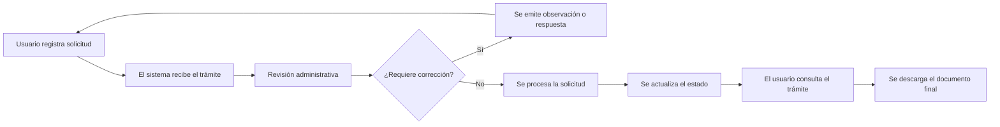
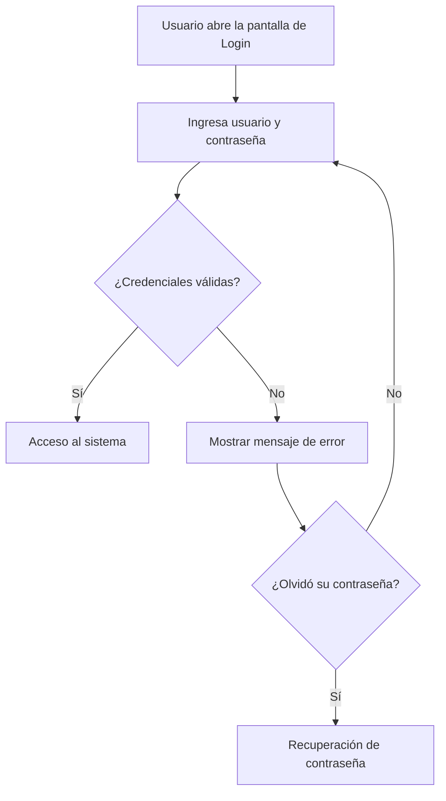
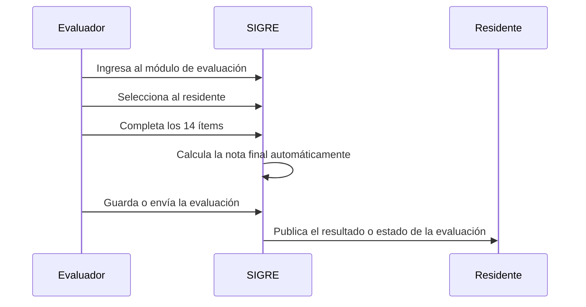

# Presentación y Diagramas del Sistema

## Presentación

SIGRE es la plataforma institucional del INCOR para administrar el residentado de manera centralizada. Desde el sistema se gestionan solicitudes, evaluaciones, documentos, cupos, asistencia, usuarios y monitoreo operativo.

Este manual está orientado a explicar el uso práctico del sistema para cada perfil de usuario, con un lenguaje claro y una estructura apta para documentación institucional.

## Diagramas del sistema

### Vista general de usuarios y módulos

```mermaid
flowchart TD
    A[Ingreso a SIGRE] --> B{Tipo de usuario}

    B --> C[Residente]
    B --> D[Evaluador]
    B --> E[Administrativo OAIYDE]
    B --> F[Personal Universitario]
    B --> G[Super-Admin]

    C --> C1[Disponibilidad]
    C --> C2[Registro de Solicitud]
    C --> C3[Consulta de Trámite]
    C --> C4[Registro / Actualización de Perfil]
    C --> C5[Descarga de Documentos]

    D --> D1[Evaluación de Residentes]
    D --> D2[Instrumento de 14 ítems]
    D --> D3[Cálculo automático de nota final]

    E --> E1[Registro de Solicitud]
    E --> E2[Asignación de Cupos]
    E --> E3[Verificación de Asistencia]
    E --> E4[Gestión de Respuestas]
    E --> E5[Generación de Hojas de Evaluación]
    E --> E6[Plan de Trabajo]
    E --> E7[Monitoreo de Evaluaciones]

    F --> F1[Disponibilidad]
    F --> F2[Consulta de Trámite]
    F --> F3[Descarga de Hojas de Evaluación]
    F --> F4[Descarga de Cartas de Respuesta]

    G --> G1[Gestión de Usuarios]
    G --> G2[Privilegios de Acceso]
    G --> G3[Configuración del Sistema]
    G --> G4[Estadísticas del Programa]
    G --> G5[Monitoreo del Sistema]
    G --> G6[Asignación de Roles]
```

### Flujo general de una solicitud

### Flujo de autenticación

### Flujo de evaluación de residentes

