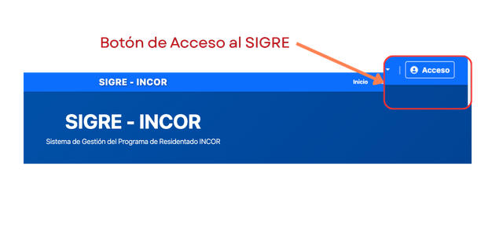
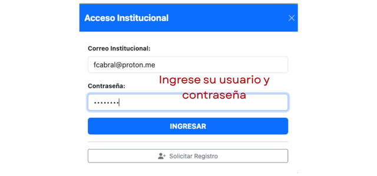
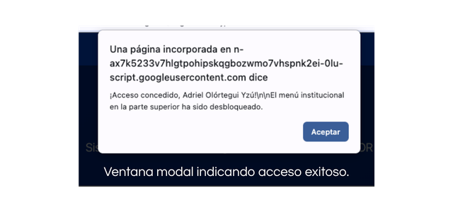

---
tags:
  - acceso
  - seguridad
  - roles
  - "#usuarios"
---

# Acceso al Sistema

El Sistema de Gestión de Residentado (SIGRE) cuenta con un componente de acceso restringido, denominado área de **Gestión Institucional**, cuyo acceso es exclusivo para el personal del INCOR que participa en la gestión del Programa de Residentado del instituto y para el personal asistencial que participa en las actividades docente-asistenciales de formación de los residentes.

El acceso está definido de acuerdo a los roles definidos dentro del Sistema Nacional de Residentado Médico (SINAREME) del Perú. Los roles están definidos en la tabla siguiente:

---

## 🔐 Requisitos para acceder

Para ingresar al sistema, usted debe contar con:
1. Un correo electrónico registrado.
2. Una contraseña temporal o permanente asignada por la OAIYDE.

!!! Advertencia "Importante"
    Si usted es un usuario externo (médico, residente, enfermera, trabajador o docente de una universidad, que desea informarse sobre el programa de residentado en el INCOR; **no necesita iniciar sesión**. Toda la información relevante para su trámite se encuentra disponible libremente en el menú de **Acceso Público**.

---

## 🚀 Pasos para Iniciar Sesión

1. Ingrese a la página principal del [SIGRE](https://script.google.com/macros/s/AKfycby3p6gTdLzHaeG0qV5uwrlIF7ZM8YkZ_TcAuBm7hC1JdP9clUHcg0wlQ93gP5toNdNy/exec).
2. En la barra de navegación superior (esquina superior derecha), haga clic en el botón **"Acceso"**.
   
   

3. Aparecerá una ventana emergente. Ingrese su **Correo Electrónico** y su **Contraseña**.
4. Haga clic en el botón **"INGRESAR"**.

   

5. Si su usuario y contraseña son correctas, aparecerá una ventana modal indicándole que sus credenciales han sido aceptadas.

   

---

## 🛡️ Niveles de Usuario (Roles)

Una vez iniciada la sesión, al hacer clic en **Gestión Institucional**, usted verá únicamente los módulos necesarios para sus funciones. 

Dependiendo de su perfil, tendrá acceso a:

* **Administrador INCOR:** Registro, Asignación, Evaluación, Rotaciones, Monitoreo y Estadísticas.
* **Funcionario Asistencial:** Monitoreo, Rol de rotaciones y Estadísticas.
* **Evaluador:** Módulo de Evaluación, Monitoreo y Rol de rotaciones.
* **Profesional Asistencial:** Rol de rotaciones y descarga del rol.

En todos los niveles de usuarios, también se cuenta con acceso a los módulos de Disponibilidad y Consulta del estado de las solicitudes.

---

## 🚪 Cerrar Sesión

Por su seguridad, especialmente si comparte el equipo de cómputo en su servicio, recuerde cerrar su sesión al terminar sus labores.

1. Diríjase a la esquina superior derecha.
2. Haga clic en el botón rojo **"Salir"**.
3. El sistema ocultará los módulos institucionales y protegerá su información inmediatamente.

---

## ❓ Problemas de Acceso

Si olvidó su contraseña o el sistema indica "Credenciales incorrectas":
1. Verifique que está ingresando el correo exacto con el que fue registrado.
2. Comuníquese con la **Oficina de Apoyo a la Investigación y Docencia Especializada (OAIYDE)** al anexo **5911** o envíe un mensaje al WhatsApp de soporte para solicitar el restablecimiento de su clave.

---
