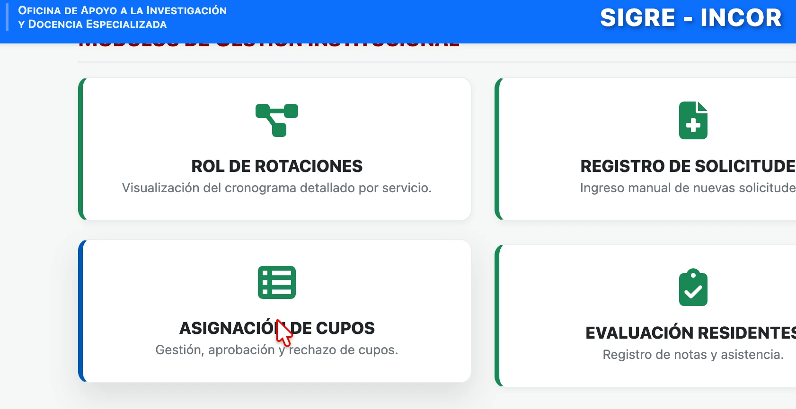

---
tags:
  - "#mod-disponibilidad"
  - "#acceso_libre"
  - "#consulta_cupos"
---

## 📊 1. Matriz de Disponibilidad

Antes de asignar a un residente, el administrador debe verificar los cupos libres. El sistema ofrece una vista rápida de la capacidad del INCOR.

1. Ingrese a **Gestión Institucional > Asignación**.
2. En la parte superior, visualizará el tablero resumen de **Campos Clínicos**.
3. Este tablero muestra el total de plazas, las ocupadas y las vacantes disponibles por cada servicio (ej. Cardiología Clínica, Cirugía Cardiovascular, Cuidados Intensivos).

{: style="display: block; margin: 0 auto;" }
  

    <i>Figura 1: Tablero de control de disponibilidad por servicio.</i>
  

> [!tip] Planificación
> Revise siempre este tablero antes de proceder con una asignación para evitar sobrepoblar un servicio en un mes determinado.

---
