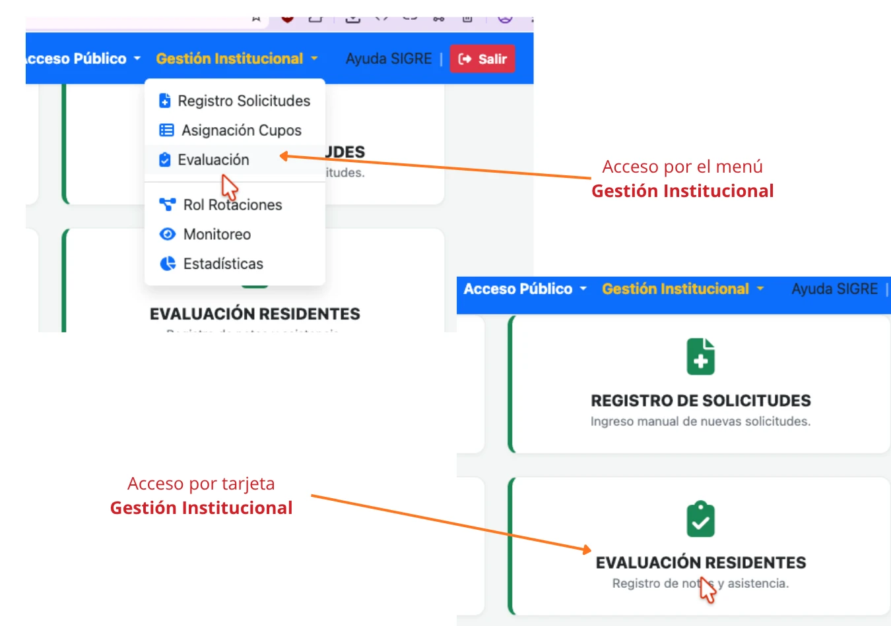
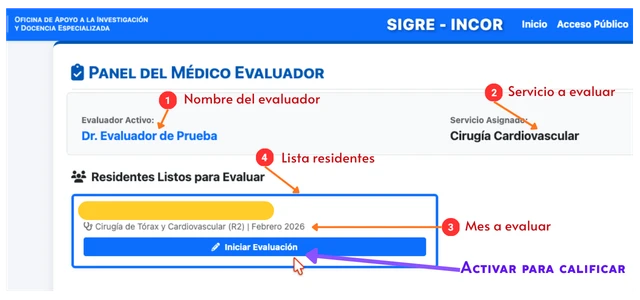
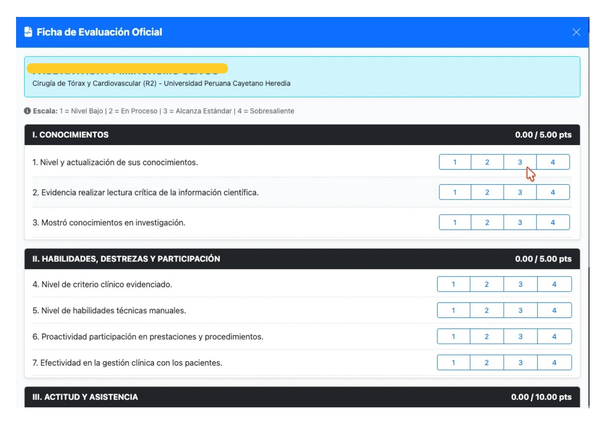
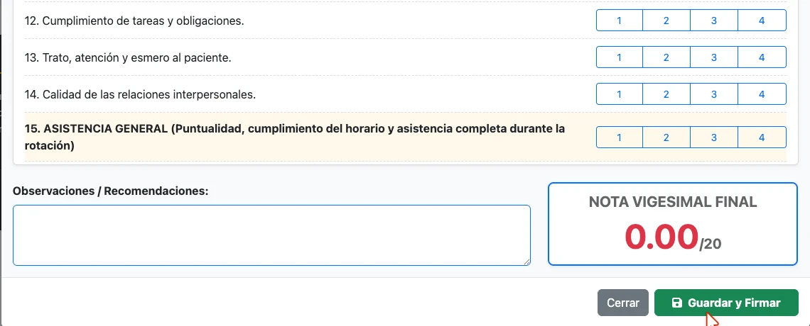

---
tags:
  - mod-evaluacion
  - rol-evaluador
  - rol-jefe-servicio
  - calificacion
---

# Evaluación de Residentes

El módulo de **Evaluación** es la herramienta exclusiva para que los profesionales de la salud designados en el INCOR, califiquen el rendimiento de los residentes mensualmente.

Las evaluaciones del rendimiento de los residentes es por cada rotación, entendiéndose por rotación al periodo mensual de rotación en un servicio clínico o área administrativa que corresponda.

Los evaluadores son profesionales de la salud designados para evaluar a los residentes de las especialidades profesionales correspondientes, que laboran en los servicios donde los residentes realizan sus rotaciones.

---

> [!important] **REQUISITO PREVIO**
> Para acceder al módulo **"Evaluación Residentes"** es necesario ingresar al subsistema de [Gestión Institucional](acceso_sistema.md) con su usuario y contraseña.

## 📋 1. Panel del Evaluador

Al [ingresar al sistema](acceso_sistema.md) con su rol de **Evaluador**, proceda a activar la tarjeta **"Evaluación Residentes"** o a través del menú **Gestión Institucional > Evaluación**, tal como se muestra en la figura 1.

{: style="display: block; margin: 0 auto;" }
  

    <i>Figura 1: Vías de acceso al módulo de Evaluación Residentes.</i>
  

Luego de completarse la carga de la página del módulo, para evaluar a los residentes deberá seguir los siguientes pasos:

1. Verifique la siguiente información (Figura 2) 
	- Su nombro como evaluador.
	- El servicio que usted evaluará.
	- El mes de evaluación que corresponda al mes último culminado.
	- La lista de residentes a evaluar.
2. En el recuadro de los nombres de los residentes a evaluar, active el botón *"Iniciar evaluación"* (Figura 2).

{: style="display: block; margin: 0 auto;" }
  

    <i>Figura 2: Vista del panel del evaluador del Módulo de Evaluación.</i>
  

1. Aparecerá el instrumento de evaluación, donde procederá a calificar todos los ítems de evaluación.  Conforme llene el instrumento, la calificación se generará en tiempo real (Figura 3).

{: style="display: block; margin: 0 auto;" }
  

    <i>Figura 3: Instrumento de evaluación de los residentes.</i>
  

> [!info] Cálculo Automático
> No es necesario que usted calcule promedios. Conforme vaya ingresando las notas parciales, el sistema SIGRE calculará automáticamente el **Promedio Final** en tiempo real al final del formulario.

4. Una calificados todos los ítems del instrumento y luego de verificar su calificación, proceda a registrar la evaluación activando el botón "Guardar" (Figura 4).

{: style="display: block; margin: 0 auto;" }
  

    <i>Figura 4: Botón de envío y registro de la evaluación.</i>
  

Completados estos pasos, regresará al listado de residentes para seguir con la evaluación que corresponda.

---

> [!warning] Acción Irreversible
> Una vez que hace clic en "Guardar", el acta se cierra y **la nota no podrá ser modificada**. Si cometió un error, deberá comunicarse con la OAIYDE para solicitar un extorno de la nota.

---

