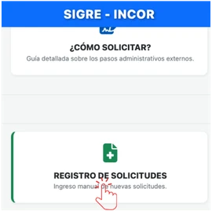
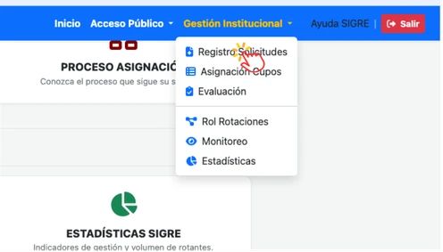
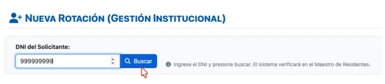
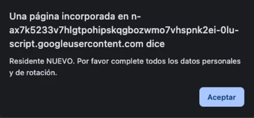
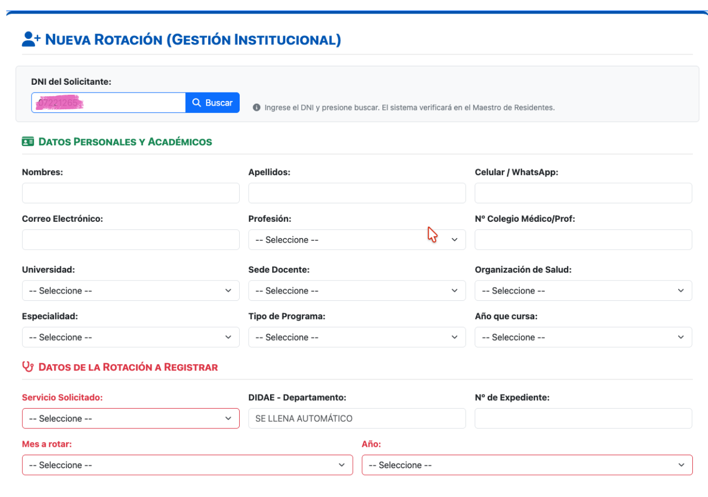
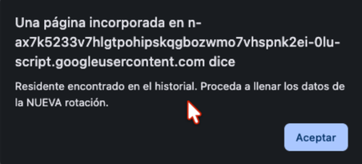
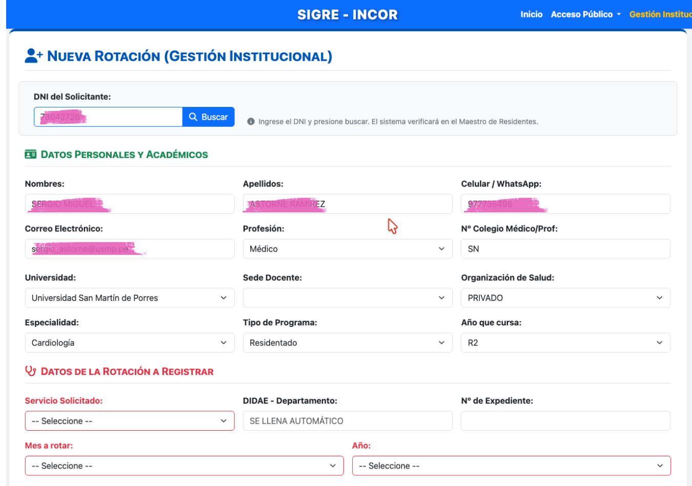
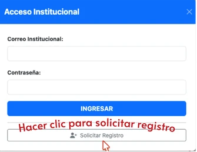
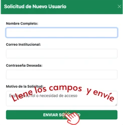

---
tags:
  - mod-registro
  - gestion-usuarios
  - rol-superadmin
  - rol-admin-incor
---

# Registro de Solicitudes y Usuarios

El módulo de **Registro de Solicitudes** es el centro de recepción de las solicitudes en el SIGRE. En esta sección, el personal de la OAIYDE gestiona dos flujos de trabajo críticos:

1. Las solicitudes de rotación enviadas por los médicos residentes.
2. Las solicitudes de registro de nuevos usuarios al SIGRE.

---

## 📄 1. Registro de solicitudes

El registro de las solicitudes se realiza una vez que la documentación física ha sido entregada a la Asistente Administrativa de la OAIYDE, quien ingresara como usuaria institucional al SIGRE, para registrar las solicitudes en el sistema.

### Módulo: Registro de Solicitudes
Sea mediante la tarjeta *"Registro de Solicitudes"* (Figura 1) o activando en el menú **Gestión Institucional > Registro Solicitudes** (Figura 2), se ingresa al formulario de registro de solicitudes. 

{: style="display: block; margin: 0 auto;" }
  

    <i>Figura 1: Vista de la bandeja principal del sistema.</i>
  

{: style="display: block; margin: 0 auto;" }
  

    <i>Figura 2: Acceso al módulo de Registro de solicitudes a través del menú.</i>
  

Luego de activa, se iniciará el proceso de registro, para lo cual se seguirán los siguientes pasos:

1. Se activará el formulario solicitando el número de DNI, que una vez ingresado, se procederá a activar el botón **Buscar** (Figura 3).

{: style="display: block; margin: 0 auto;" }
  

    <i>Figura 1: Vista de la bandeja principal del sistema.</i>
  

1. El sistema identificará si se trata de un **"Solicitante Nuevo"** o una **"Solicitud Nueva"**. Lo que determinará el contenido del formulario que aparezca para registro, de acuerdo a lo siguiente:
	- *Solicitante nuevo*: Aparecerán el formulario completo, que incluye datos de identificación, formación, universidad, sede docente y de la solicitud a la que pretende acceder el solicitante (Ver Figuras 4 y 5).

{: style="display: block; margin: 0 auto;" }
  

    <i>Figura 4: Mensaje indicando que el solicitante es nuevo.</i>
  

{: style="display: block; margin: 0 auto;" }
  

    <i>Figura 5: Formulario para registrar nuevo solicitante.</i>
  

- *Solicitud nueva*: Se desplegaran los mismos campos descritos previamente, pero con los datos del solicitante al que corresponde el DNI ingresado, solo los campos de la solicitud estarán en blanco y serán llenados con los datos de la nueva solicitud (Figura 6 y 7).

{: style="display: block; margin: 0 auto;" }
  

    <i>Figura 6: Mensaje indicando que el solicitante es antiguo.</i>
  

{: style="display: block; margin: 0 auto;" }
  

    <i>Figura 7: Formulario para registrar solicitante antiguo.</i>
  

1. Luego de ingresar los datos correspondientes, la solicitud quedará registrada luego de activar el botón **"Registrar"**.

> [!tip] Búsqueda Rápida
> Utilice la caja de búsqueda en la parte superior de la tabla para encontrar rápidamente a un residente por su DNI o apellido.

### Asignación de los cupos
La solicitud registrada deberá ser revisada y contrastada con los registros de rotaciones asignadas y se decidirá el otorgamiento en la OAIYDE. El módulo para este procesamiento se desarrolla en [Asignación de Cupos](asignacion.md).

---

## 👤 2. Registro de Usuarios al SIGRE

Por ser la primera implementación del sistema y considerando que su uso es exclusivamente institucional, todos los usuarios pertenecen al INCOR y tendrán acceso según los listados de profesionales y residentes que maneja la OAIYDE al momento del lanzamiento.

Como la lista en la que se base la creación de cuentas de usuarios, puede no ser lo suficientemente exhaustiva, se ha habilitado la opción de solicitar una cuenta de usuario. El proceso se describe a continuación.

### Proceso de Registro de un Nuevo Usuario

1. **Formulario de Solicitud:** En la parte inferior de la ventana de Acceso, aparece la opción de solicitar el registro.  Proceder a activarlo y aparecerá un pequeño formulario (Figura 8).
2. **Llenar el formulario de solicitud:** El interesado procederá a completar los datos solicitados y enviar su solicitud (Figura 9).
3. **Respuesta a la solicitud:** En caso corresponda brindar el acceso al solicitante, en un plazo no mayor de 72 horas hábiles, el acceso será habilitado. El administrador del Sistema puede solicitar información complementaria en caso sea necesario.

{: style="display: block; margin: 0 auto;" }
  

    <i>Figura 8: Activar la solicitud para nuevo usuario.</i>
  

{: style="display: block; margin: 0 auto;" }
  

    <i>Figura 9: Formulario para solicitar registro nuevo usuario.</i>
  

### 🙆🏽 Recuperar contraseñas

En caso olvide su contraseña o su usuario, puede recuperarla por dos vías:

1. Enviar una mensaje vía [WhatsApp](https://wa.me/51954959827?text=Hola,%20necesito%20recuperar%20mi%20usuario%20o%20contraseña%20del%20SIGRE.){:target="_blank"}.
2. Enviar un mensaje de correo electrónico a oaiydeincor@gmail.com

El equipo de la OAIYDE le responderá a la brevedad.👩🏻‍💻

---
